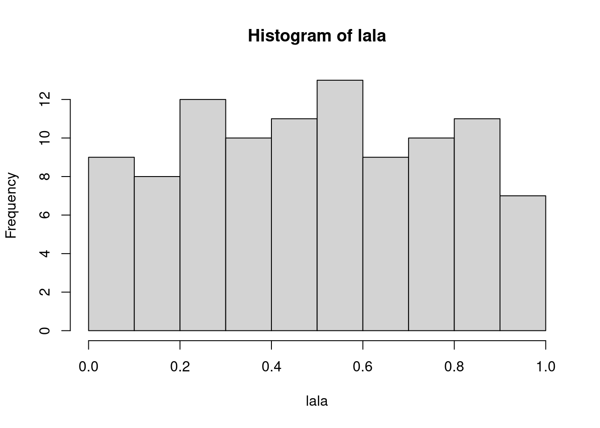

So cool. [`usethis::use_git()`](https://usethis.r-lib.org/reference/use_git.html).

<pre class='chroma'><code class='language-r' data-lang='r'>lala &lt;- <a href='https://rdrr.io/r/stats/Uniform.html'>runif</a>(100)
<a href='https://rdrr.io/r/graphics/hist.html'>hist</a>(lala)

</code></pre>

